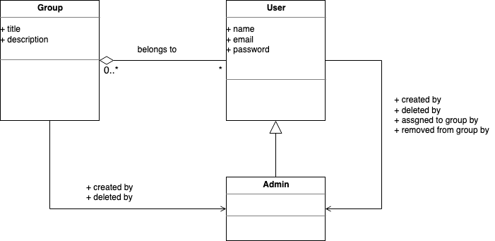
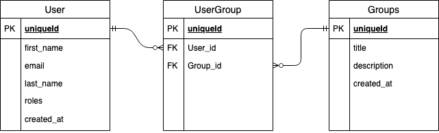

## Environment Setup

### Initial steps

1. [Install Docker](https://www.docker.com/get-started)
2. Clone this project

### Environment configuration

1. Create a local environment file (`cp .env .env.local`) if you want to modify any parameters.

## Usage

First of all you should execute:

```
make init_db
```

Next, setup local environment by executing:

```
make prepare-local
```

And then start local environment:

```
make start-local
```

And then call `http://localhost:8000/health-check` to check all is ok.

## Documentation

### Domain model for the processes



### Database ER model



### API OAS documentation

[can be found here](docs/User-Management-API.yaml)

### Assumptions

API user is an admin user and has all the permissions; hence login, password management, etc., is not implemented. Users will pass only expected data - request validation and error handling is not implemented. 